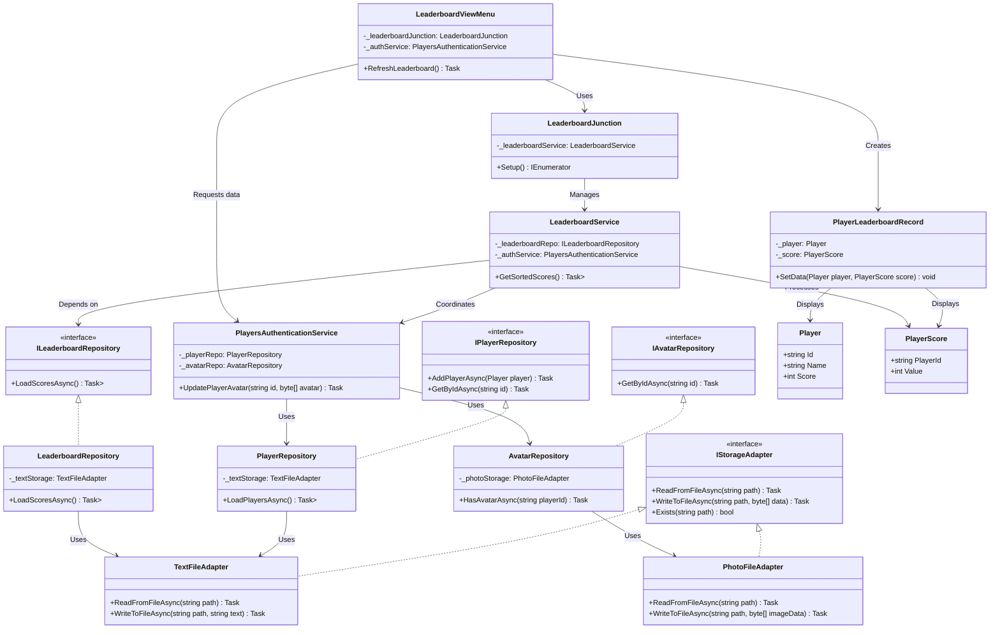
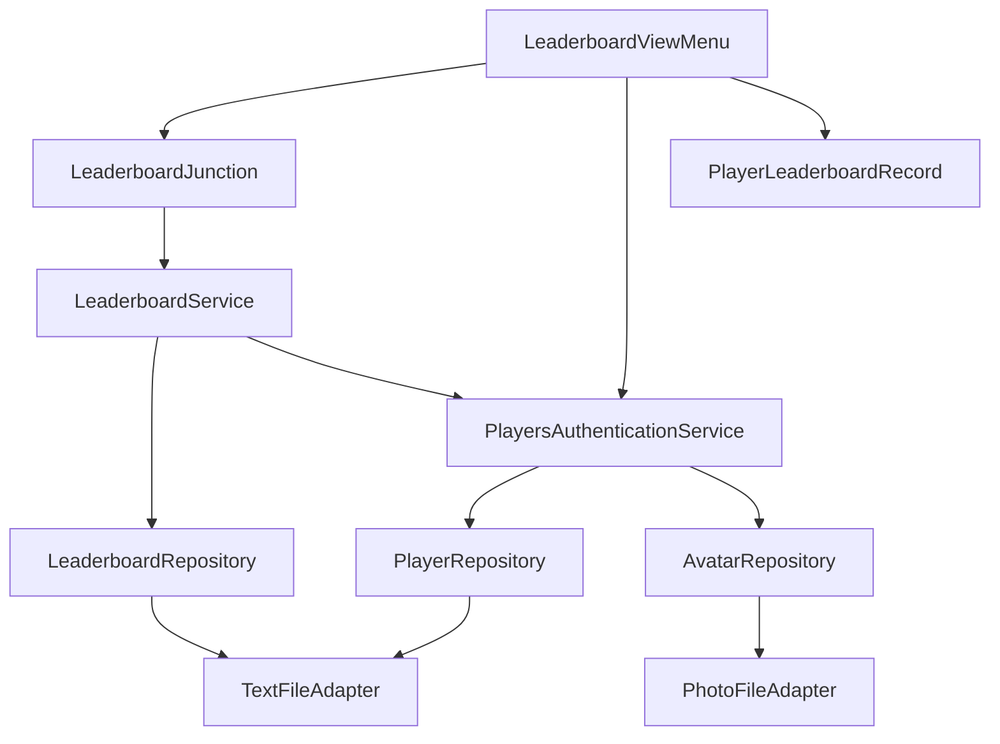

# GitHub README


# Unity Leaderboard System (Experimental)


An experimental leaderboard system implementing core CRUD operations with optimized UI rendering and data persistence. Built to test software engineering architecture patterns in Unity.

## Features

- 🏆 Dynamic leaderboard with player profiles
- 📸 Profile picture management
- ✅ CRUD operations:
  - Add new players
  - Update existing entries
  - Remove players
  - View detailed profiles
- 📱 Responsive UI using Unity Layout Groups
- 💾 Persistent storage system with:
  - Async file operations
  - Separate data repositories
  - Service base design
  - Scalable infrastructure
  - Flexible Codebase

## Installation

1. Clone repository
2. Open in Unity 6.0.44f1 or newer
3. Navigate to Main scene
4. Run the leaderboard demo

## Project Structure

```
Assets/
├── Storage/
│   ├── File system adapters (Text/Photo)
│   └── Async IO operations
├── Repositories/
│   ├── Player data management
│   ├── Avatar handling
│   └── Leaderboard persistence
├── Services/
│   ├── Business logic layer
│   ├── Authentication service
│   └── Score management
└── UI/
    ├── Leaderboard view components
    ├── Profile display system
    └── Responsive layout controllers
```

## Key Components

- **Async Operations**: Non-blocking file operations using C# async/await
- **Storage Adapters**: Abstract file system operations
- **Repository Pattern**: Separates data access from business logic
- **Service Layer**: Handles core application logic
- **Optimized UI**: Uses pooling and selective updates

## Experimental Notes

This system was created to explore:
- Clean architecture principles
- Repository pattern implementation
- Service base design
- Async data persistence
- UI optimization techniques
- Modular system design

Not recommended for production use - some components are simplified for experimentation purposes.

## Possible Improvements

- Add cloud storage integration
- Implement binary serialization
- Add undo/redo system
- Create automated tests
- Better Sprites


## Diagram Legend

- **Storage Layer**: File system operations and adapters
  - `IStorageAdapter`: Interface for storage operations
  - Concrete adapters handle specific data types (text/photos)
  
- **Repository Layer**: Data management
  - Player/Avatar repositories handle domain objects
  - Uses storage adapters for persistence
  - Contains data models (Player, PlayerScore)

- **Service Layer**: Business logic
  - Coordinates repositories and UI
  - Handles authentication and score management
  - Uses coroutine runner for async operations

- **UI Layer**: Presentation
  - View components for leaderboard display
  - Profile management interface
  - Responsive layout controllers

## Flow
1. UI components request data through Services
2. Services coordinate repositories
3. Repositories use storage adapters for persistence
4. Data flows back through same chain

## Key Interfaces
- `IStorageAdapter`: File operations contract
- `IPlayerRepository`: Player CRUD operations
- `ILeaderboardService`: Score management API
